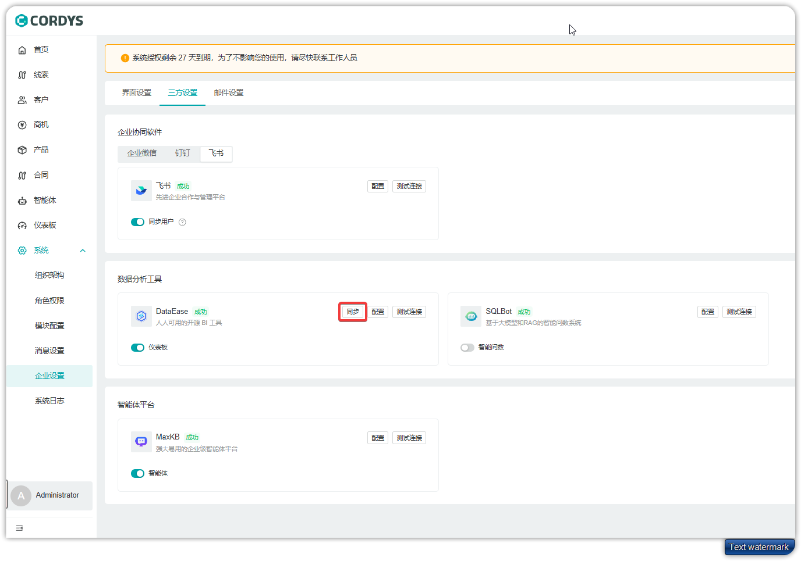

!!! Abstract ""

     **注意**：需要用到 DataEase 的商业版本（嵌入式/专业版/企业版），请参考：[DataEase 版本说明](https://dataease.cn/versions.html)

## 获取 DataEase 对接信息

!!! Abstract ""
    在 DataEase 系统中获取必要的对接参数和配置信息。


## 配置 DataEase 跨域设置

!!! Abstract ""

    为确保 Cordys CRM 能够正常访问 DataEase，需要在 DataEase 中配置跨域设置。
    

## Cordys CRM 页面配置

!!! Abstract ""

    在 Cordys CRM 系统中配置 DataEase 集成设置：

    1. 登录 Cordys CRM 系统
    2. 进入【系统】>【企业设置】>【三方设置】
    3. 配置 DataEase 相关参数


---

## 开启仪表板菜单权限

配置完成后，需要为相关用户开启仪表板菜单的访问权限。


## 数据同步
!!! Abstract ""

    在 【系统】>【企业设置】>【三方设置】>【DataEase】中点击同步，即可将 Cordys CRM 中用户、角色、部门等的信息同步到 DataEase 中，配置页面也可以配置定时同步。


## 编写通用数据集
!!! Abstract ""

    Cordys CRM 通过数据权限的设计，使得不同角色能够访问到不同数据范围的数据；经过数据同步后，DataEase 会创建对应的用户与角色，并且创建数据权限和部门ID的系统变量，用户可以在编写数据集时，使用这些变量过滤数据，确保用户只能访问到有权限的数据。
    
    ```
    -- 关键SQL
    select c.*
    from opportunity c
    left join sys_organization_user sou on c.owner = sou.user_id
    where c.organization_id = '100001'
    and
    (   
        -- 根据数据权限和部门ID过滤数据
        ($DE_PARAM{'$f2cde[OPPORTUNITY_DATA_SCOPE_TYPE]' = 'ALL'} or $DE_PARAM{'$f2cde[账户]' = 'admin'})
        or
        ($DE_PARAM{ '$f2cde[OPPORTUNITY_DATA_SCOPE_TYPE]' = 'DEPT_CUSTOM'} and $DE_PARAM{ sou.department_id in ($f2cde[OPPORTUNITY_DATA_SCOPE_DEPT_ID])})
        or
        ($DE_PARAM{'$f2cde[OPPORTUNITY_DATA_SCOPE_TYPE]'} = 'SELF' and  $DE_PARAM{sou.user_id = '$f2cde[账户]'})  
        or
        1=2
    )
    ```
    
    ```
    -- 示例SQL
    select 
    c.id,
    c.name as '商机名称',
    su.name as '负责人', 
    sd.name as '部门',
    c.amount as '金额',
    osc.name as '商机阶段',
    cc.name as '客户名称',
    IF(sou.enable, '否', '是') as '是否离职',
    FROM_UNIXTIME(c.create_time / 1000) as '创建时间',
    FROM_UNIXTIME(c.update_time / 1000) as '更新时间', 
    FROM_UNIXTIME(c.expected_end_time / 1000) as '结束时间',
    FROM_UNIXTIME(c.actual_end_time / 1000) as '实际结束时间',
    FROM_UNIXTIME(c.follow_time / 1000) as '跟进时间',
    (
        select REPLACE(REPLACE(REPLACE(JSON_ARRAYAGG(p.name), '"', ''), '[', ''), ']', '') 
        from product p 
        where c.products like concat('%', p.id, '%')
    ) as '产品类型',
    (
    select f.field_value
    from opportunity_field f
        where f.resource_id = c.id and f.field_id = (
            select id from sys_module_field smf where smf.internal_key = 'opportunityCode'
        )
        LIMIT 1
    ) AS '业务商机编号',
    (
        select option.label
        from opportunity_field f
        left join (
            SELECT temp.*, smfb.id as field_id
                from sys_module_field_blob smfb,
                JSON_TABLE(
                    smfb.prop, 
                    '$.options[*]' COLUMNS (
                        label VARCHAR(255) PATH '$.label',
                        value VARCHAR(50) PATH '$.value'
                    )
                ) AS temp
        ) option on f.field_id = option.field_id and option.value = f.field_value
            where f.resource_id = c.id and f.field_id = (
                select id from sys_module_field smf where smf.internal_key = 'opportunitySource'
        )
        LIMIT 1
    ) AS '商机来源'
    from opportunity c
    LEFT JOIN sys_organization_user sou on c.owner = sou.user_id  
    LEFT JOIN sys_department sd on sd.id = sou.department_id
    LEFT JOIN sys_user su on su.id = c.owner 
    LEFT JOIN customer cc on c.customer_id = cc.id
    LEFT JOIN opportunity_stage_config osc on osc.id = c.stage
    where c.organization_id = '100001'
    and
    (
        -- 根据数据权限和部门ID过滤数据
        ($DE_PARAM{'$f2cde[OPPORTUNITY_DATA_SCOPE_TYPE]' = 'ALL'} or $DE_PARAM{'$f2cde[账户]' = 'admin'})
        or
        ($DE_PARAM{ '$f2cde[OPPORTUNITY_DATA_SCOPE_TYPE]' = 'DEPT_CUSTOM'} and $DE_PARAM{ sou.department_id in ($f2cde[OPPORTUNITY_DATA_SCOPE_DEPT_ID])})
        or
        ($DE_PARAM{'$f2cde[OPPORTUNITY_DATA_SCOPE_TYPE]'} = 'SELF' and  $DE_PARAM{sou.user_id = '$f2cde[账户]'})  
        or 
        1=2
    )
    ```

## DataEase 对接效果

### 外链集成
!!! Abstract ""

    通过外链方式集成 DataEase 仪表板，用户可以在 Cordys CRM 中点击链接跳转查看数据分析结果。


### 模块嵌入
!!! Abstract ""

    将 DataEase 仪表板直接嵌入到 Cordys CRM 的相关模块中，实现无缝数据分析体验。

