!!! Abstract ""

    点击左侧菜单【系统】，进入【模块设置】页面。
    
    系统已内置以下业务表单模板：
    
    - **线索表单**
    - **客户表单**
    - **联系人表单**
    - **商机表单**
    - **报价单表单**
    - **合同表单**
    - **回款计划表单**
    - **产品表单**
    - **价格表表单**
    - **跟进记录表单**
    - **跟进计划表单**
    
    用户可以根据公司业务需求自定义表单内容。

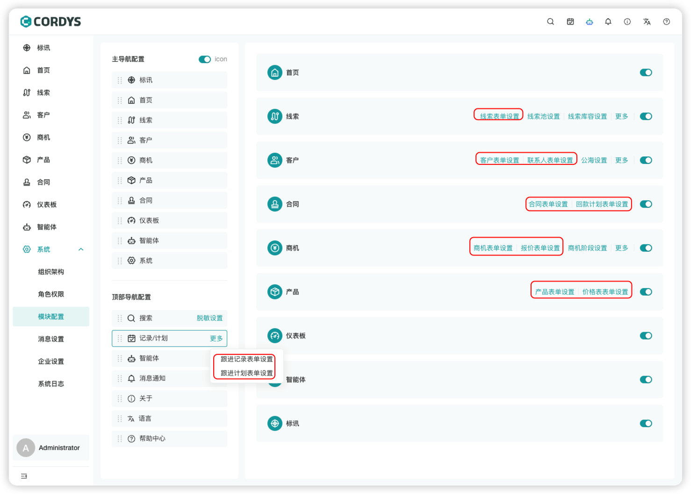

## 表单设置

!!! Abstract ""

    点击相应业务的「表单设置」按钮，进入自定义表单设置页面。

### 操作步骤

!!! Abstract ""

    1. **添加字段**：从左侧选择字段组件，拖拽至中间表单区域
    2. **配置属性**：在右侧字段属性面板修改字段的基本信息、约束、权限等
    3. **调整布局**：在表单属性中修改整体表单布局

### 表单字段设置

#### 下拉单选/下拉多选 

**显隐规则**属性

!!! Abstract ""

    在【表单设置】中，选择下拉单选/多选字段，通过配置“显隐规则”属性即可实现表单字段的显示和隐藏效果。
    
    ### 场景示例
    
    - **“线索来源”字段选择线上时，表单显示“线上来源详情“字段**
    
    ### 操作步骤
    - 进入线索表单设
    - 选择线索来源字段
    - 选择“显隐规则”
    - 设置规则，选择“线上”显示“线上来源详情”字段
    

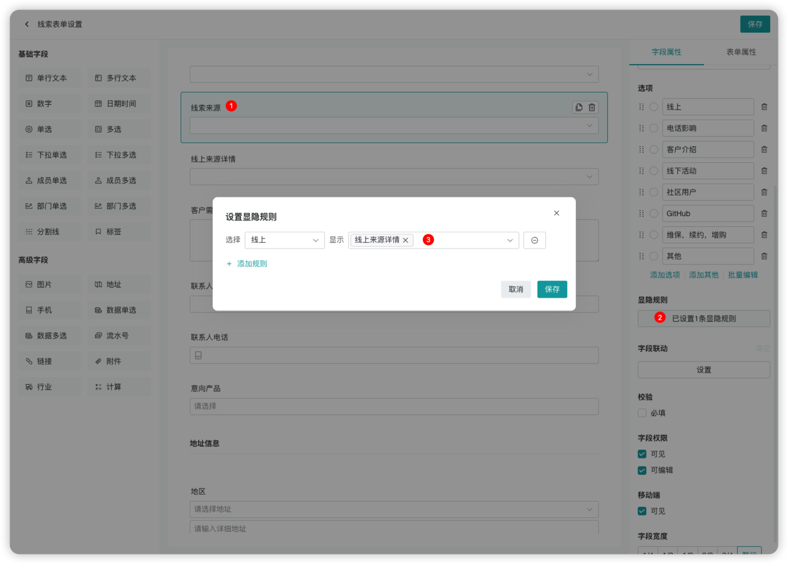

**字段联动**属性

!!! Abstract ""

    在【表单设置】中，选择下拉单选/多选字段，通过配置“字段联动”属性即可实现表单字段与字段之间的联动。
    目前之前的联动方式有两种：
    自动选择：联动字段自动选择某个选项值
    限制可选范围：限制联动字段的可选值范围
    
    ### 场景示例
    
    1. **“线索来源”字段选择线下时，联动字段“线上来源详情“自动选择选项值为”线下不涉及“**
    
    ### 操作步骤
    - 进入线索表单设
    - 选择线索来源字段
    - 选择“字段联动”
    - 联动字段选择”线上来源详情“
    - 设置规则，选择“线下”自动选择（联动字段）”线下不涉及“
    
    2. **“线索来源”字段选择线下时，联动字段“线上来源详情“限制可选范围为”400电话“**
    
    ### 操作步骤
    - 进入线索表单设
    - 选择线索来源字段
    - 选择“字段联动”
    - 联动字段选择”线上来源详情“
    - 设置规则，选择“线下”限制可选范围（联动字段）”400电话“
    
    

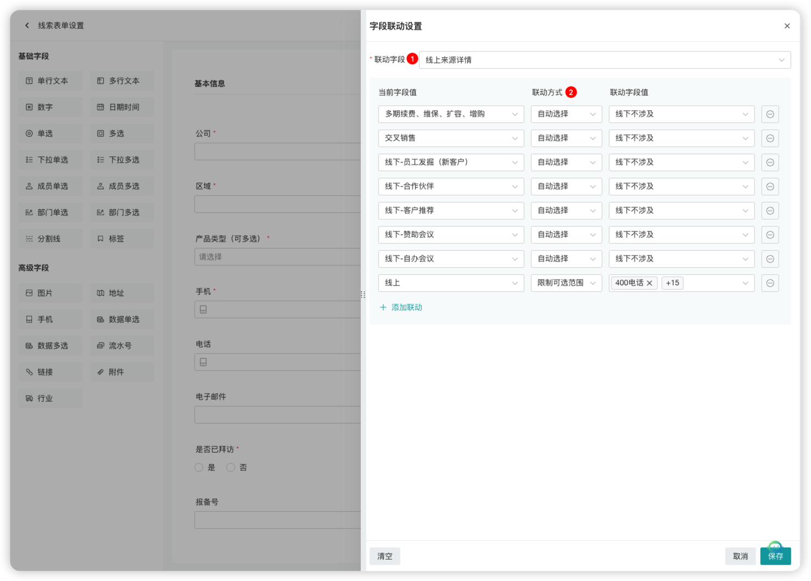

#### 数据单选/数据多选

**数据源**属性

!!! Abstract ""

    在【表单设置】中，选择数据单选/数据多选字段，通过配置“数据源”属性即可实现将用户通过表单录入的信息进行整合使用。
    
    ### 系统支持的数据源
    
    - 客户
    - 联系人
    - 商机
    - 产品
    - 线索
    - 价格表
    - 报价单
    - 合同
    

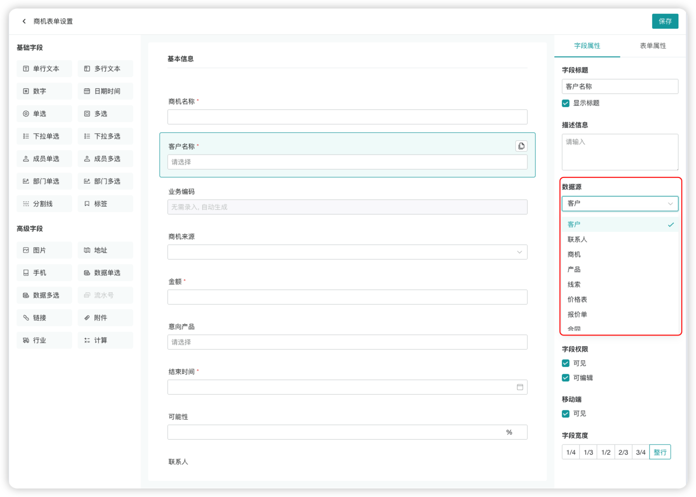

**数据过滤**属性

!!! Abstract ""

    在【表单设置】中，选择数据单选/多选字段，通过配置“数据过滤”属性即可实现对数据源展示的数据列表进行条件过滤。
    
    ### 场景示例
    
    - **创建商机时，选择客户，联系人仅展示该客户的联系人列表**
    
    ### 操作步骤
    - 进入商机表单设
    - 选择联系人字段
    - 选择“数据过滤”
    - 点击“设置”
    - 设置过滤条件“客户名属于客户名”
    

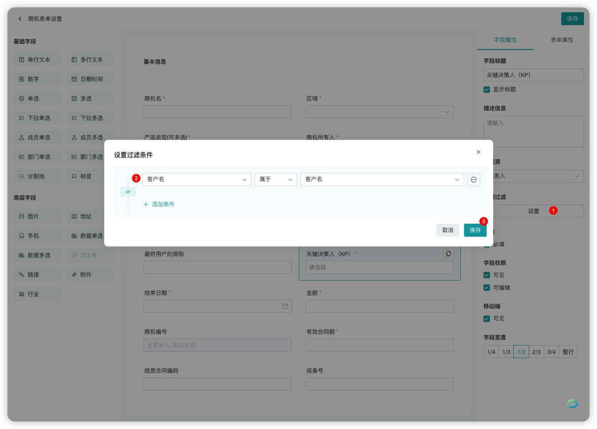

**显示字段**属性

!!! Abstract ""

    在【表单设置】中，选择数据单选/多选字段，通过配置“显示字段”属性即可实现选择数据时展示该数据的关联字段。
    
    ### 场景示例
    
    - **创建商机时，选择联系人，关联展示联系人的手机号**
    
    ### 操作步骤
    - 进入商机表单设
    - 选择联系人字段
    - 选择“显示字段”
    - 选择“手机号”
    

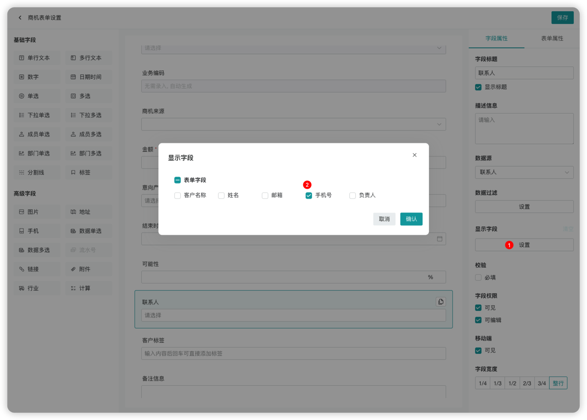

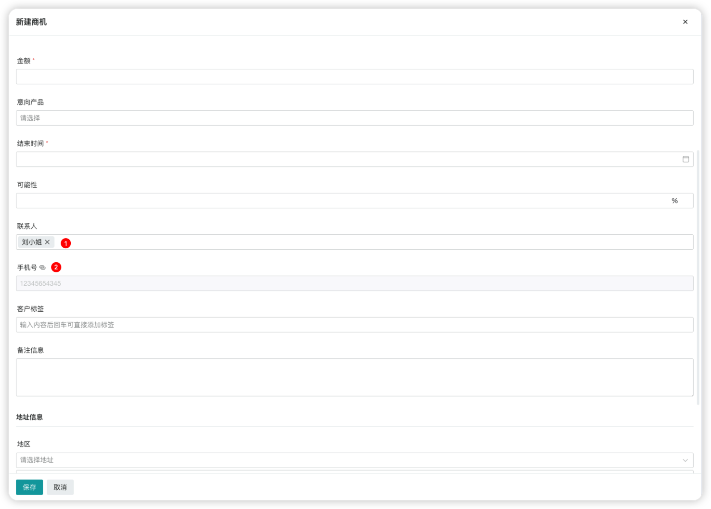

#### 计算

**公式**属性

!!! Abstract ""

    在【表单设置】中，选择计算字段，通过配置“公式”属性即可实现自动基于表单其它字段数据进行运算并生成结果。
    
    ### 操作步骤
    - 添加”计算“字段
    - 点击公式属性的设置
    - 选择当前表单可参与计算的字段（数字类型）
    - 通过运算符组成完成公式
    

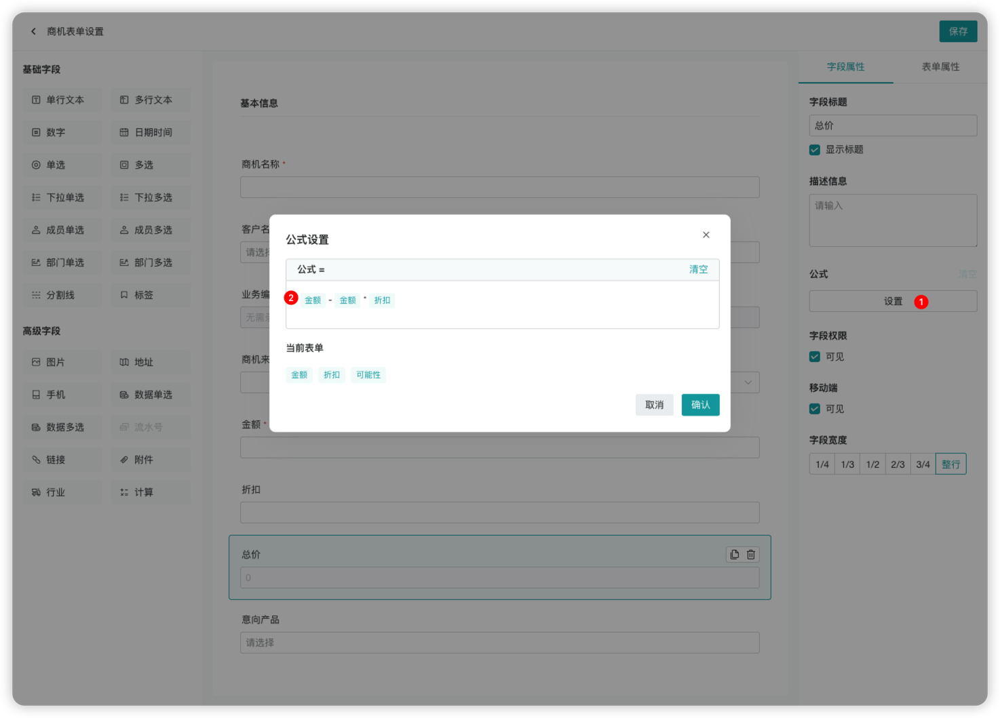

#### **手机**

**格式**属性

!!! Abstract ""

    在【表单设置】中，选择手机字段，通过配置“格式”属性即可实现手机是否严格校验11位的效果。
    系统目前支持两种格式：
    无：不校验长度，输入数字即可
    手机号：严格校验11位数字

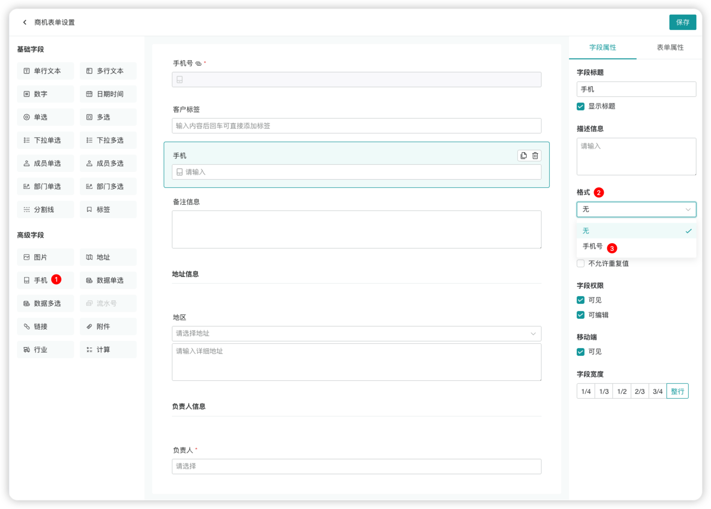

### 表单联动设置

!!! Abstract ""

    **表单联动**是一种自动同步不同表单字段数据的智能功能，可实现跨表单的信息关联与填充，无需手动重复录入。

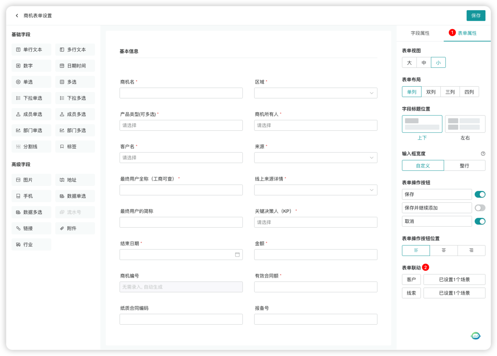

!!! Abstract ""

    ### 典型业务场景
    
    - **线索转商机**
    在【商机表单设置】中，”表单联动“属性选择【线索】模块，点击设置，配置字段对应关系。
    

## 业务规则设置

!!! Abstract ""

    在【模块设置】中，可以对不同模块的业务规则进行自定义配置。
    
    ### 可配置的业务规则
    
    - **线索池规则**
    - **移入线索池原因设置**
    - **公海规则**
    - **移入公海原因设置**
    - **库容规则**
    - **商机阶段**
    - **商机关闭原因设置**

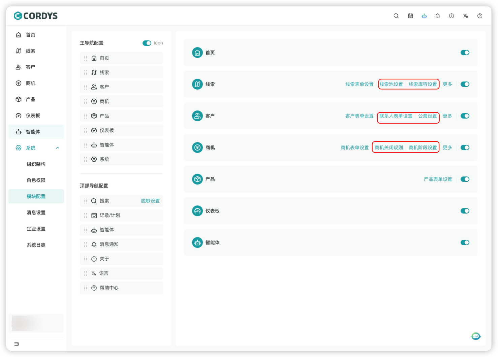

### 线索池设置

!!! Abstract ""

    线索池管理是销售团队集中管理潜在客户线索的核心工具，支持对线索池的权限、领取规则、回收机制等进行精细化配置。
    
    1. 基本信息配置
    - 自定义线索池名称，便于按业务线分类管理
    - 配置管理员（负责线索池规则维护）和成员（可领取线索的销售团队），明确权限范围。
    2. 线索领取规则
    支持多维度限制线索领取权限，避免资源抢占或闲置
    - 每日领取：控制销售每日可领取的线索数量（“不限”/“限制”）
    - 前归属人领取：限制原跟进人的重复领取权限
    - 设置新线索的 “冷却期”，避免新线索被无序争抢
    3. 线索回收规则
    自动回收长期未跟进的线索，保证资源流转效率：
    - 开启 “自动回收” 后，可按条件触发回收（如图 “入库 时间大于90天”或“最后跟进时间大于30天 ”）；
    - 规则支持组合条件（“or” 关系），灵活适配不同业务场景；
    - 时间支持配置动态时间或区间时间

- 注意：自动回收定时任务为每天**0点**执行

- 动态时间与区间时间的差异

  - **动态时间**：是相对与**当前时刻**的可变时间范围，会随系统时间自动更新
  - **区间时间**：是固**定的、有明确起止点**的时间范围，不会随当前时刻变化
  - **关键差异**：

- | 维度     | 动态时间                           | 区间时间                           |
  | -------- | ---------------------------------- | ---------------------------------- |
  | 范围特性 | 随当前时间动态变化                 | 固定起止点，永久不变               |
  | 表述方式 | 用 “近 / 过去 / 本周” 等相对词描述 | 用具体日期 / 时刻明确起止          |
  | 适用场景 | 实时数据筛选（如 “近 7 天线索”）   | 固定周期统计（如 “11 月销售数据”） |
  | 灵活性   | 高（自动适配当前时间）             | 低（需手动修改起止点）             |

  动态时间与动态-自定义时间的差异

  - **动态时间**：是相对与**当前时刻**的可变**时间范围**，会随系统时间自动更新。
    - 如：动态-上季度：假设当前时间（2025 年 12 月 10 日）对应的 “上季度” 时间范围是 **2025 年 7 月 1 日至 2025 年 9 月 30 日**。
      1. 季度划分规则：按标准自然季度，12 月属于**第四季度（10-12 月）**，因此 “上季度” 是**第三季度（7-9 月）**。
      2. 结合界面的 “动态” 选项，该时间范围会随当前系统时间自动更新（例如明年 1 月查看时，“上季度” 会变为 2025 年 10-12 月）。
  - **动态-自定义**：是相对与**当前时刻**的可变**固定时间**，会随系统时间自动更新
    - 如：动态-自定义30天前：假设当前时间（2025 年 12 月 10 日），动态30天前的时间是**2025年11月30日**。
      1. 以当前系统时间，向前回溯30天，形成一个随当前时间变化的动态时间
      2. 将30天前的数据全部回收

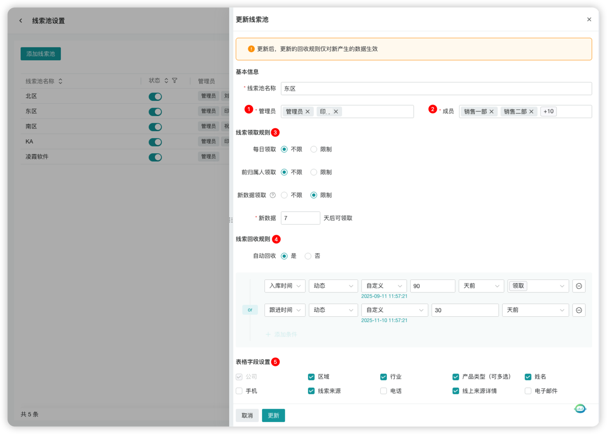

### 商机阶段设置

!!! Abstract ""

    左侧菜单点击【系统】-【模块配置】进入模块配置页，选择商机-「商机阶段设置」
    
    - 在更多操作中可以添加进行中的商机阶段
    - 进行中的商机阶段支持修改阶段名称与赢率
    - 支持自定义商机阶段回退设置

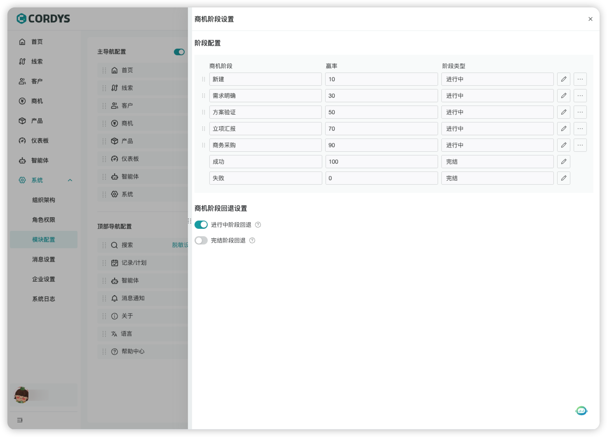

