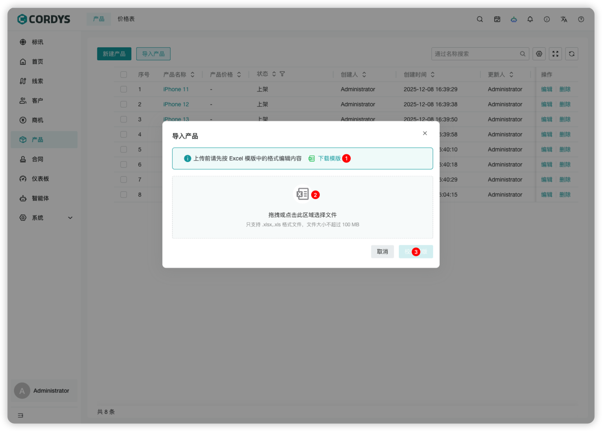
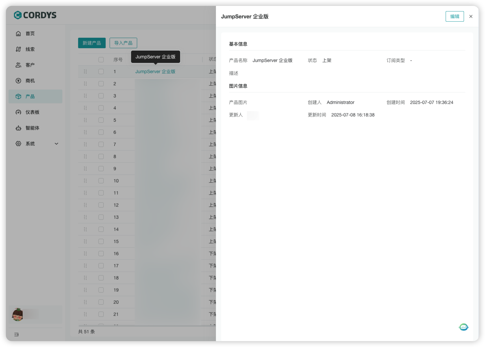
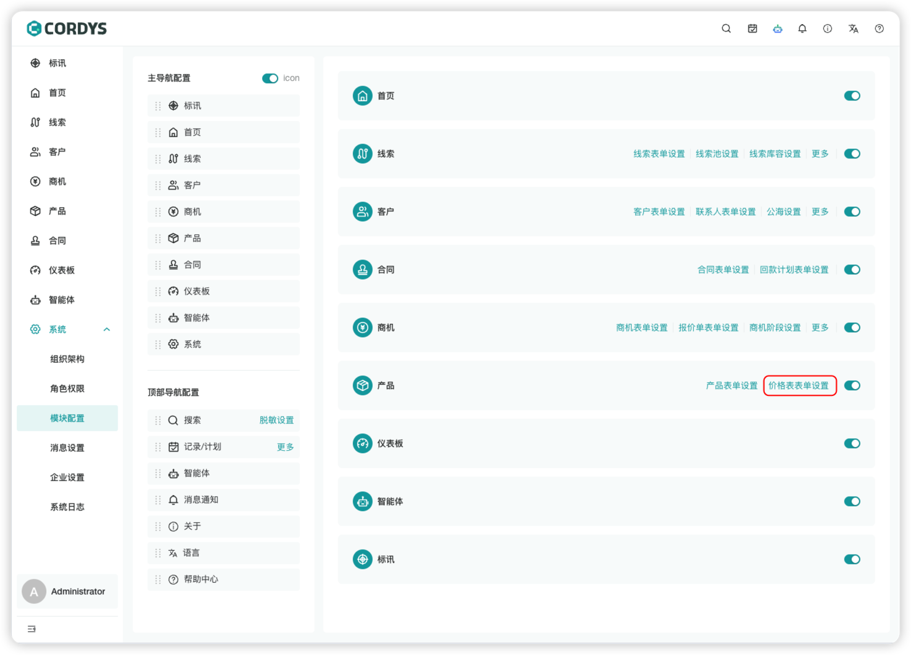
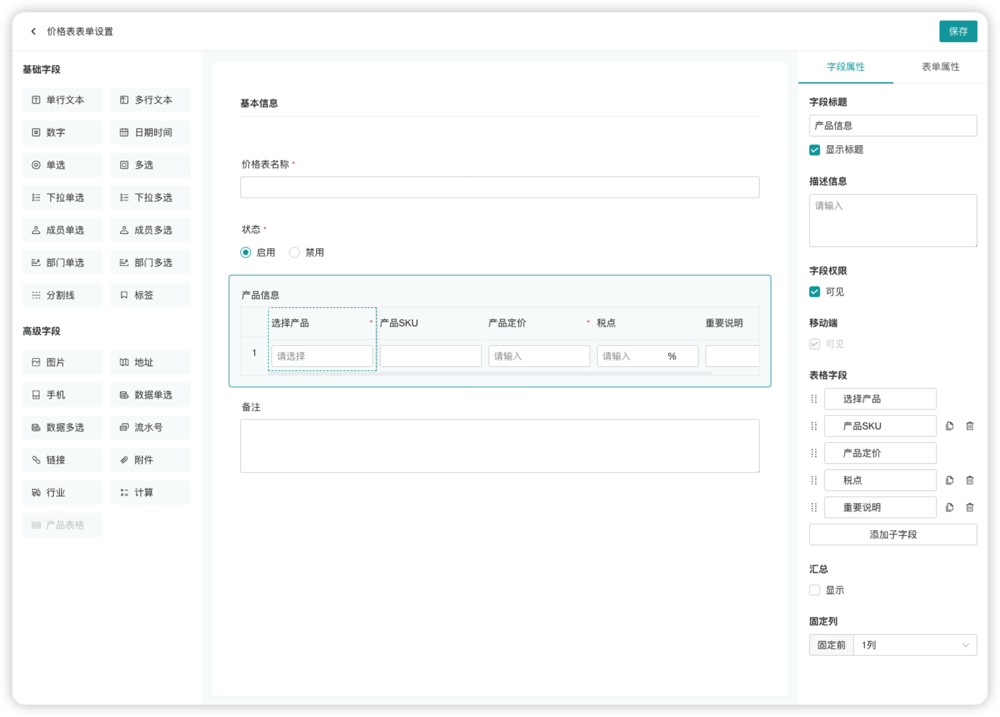
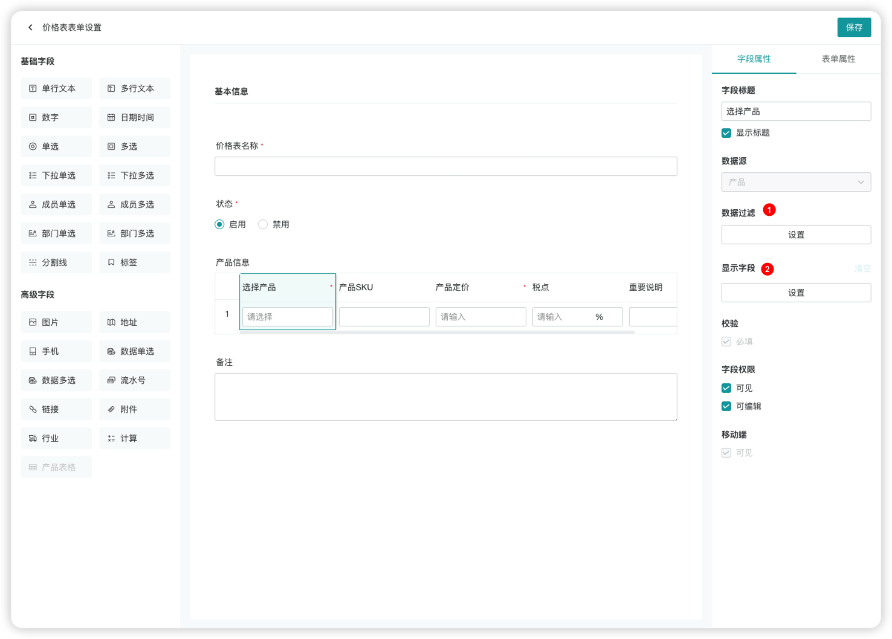
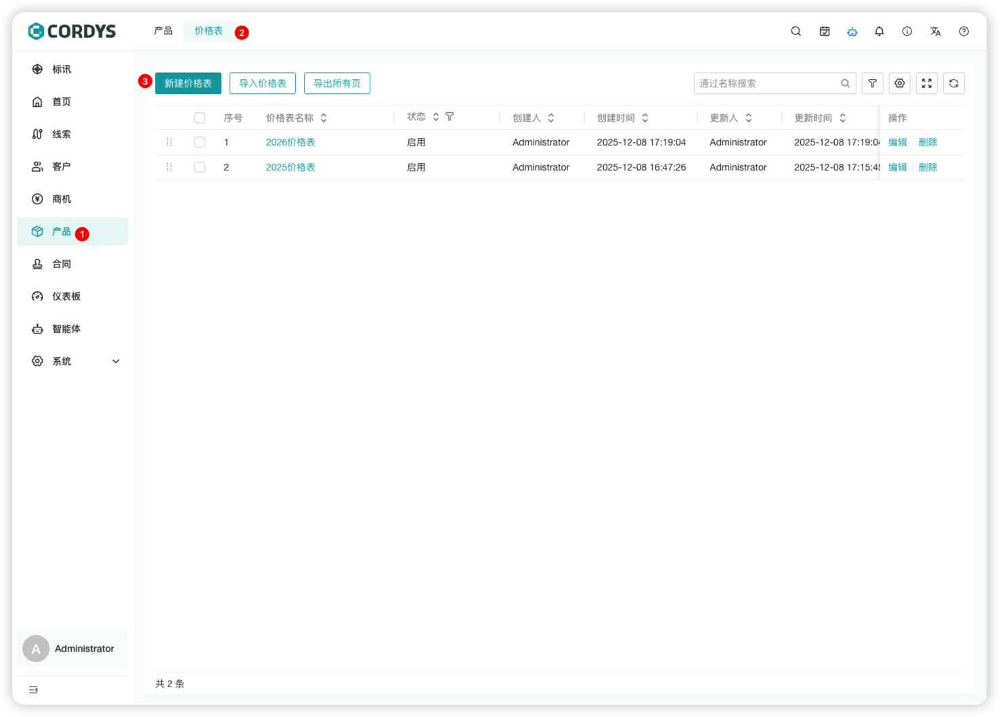
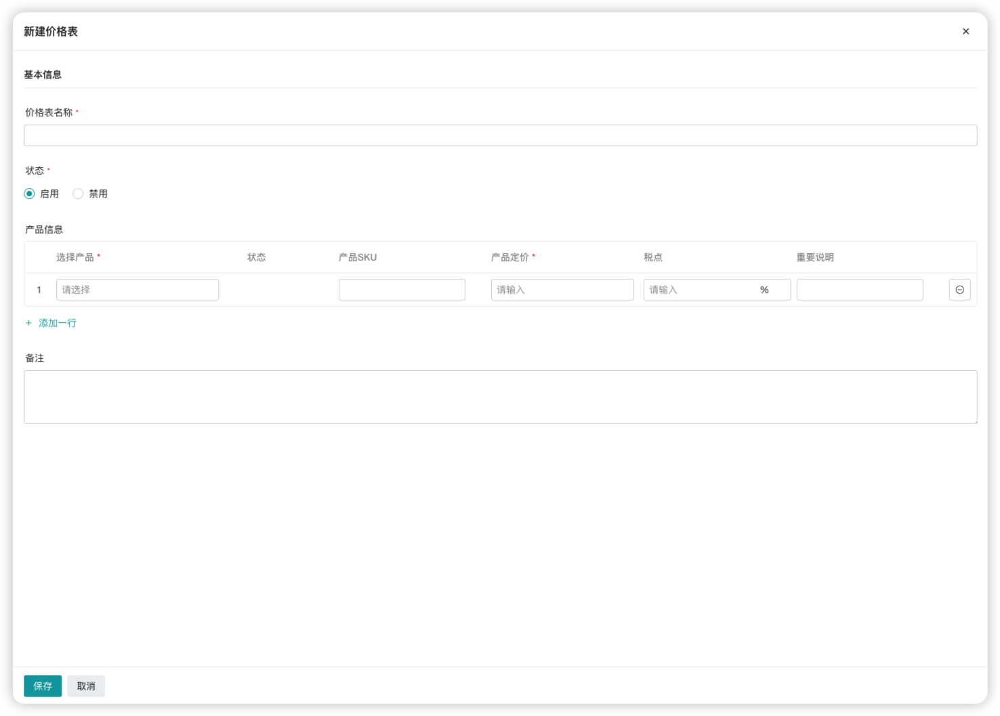
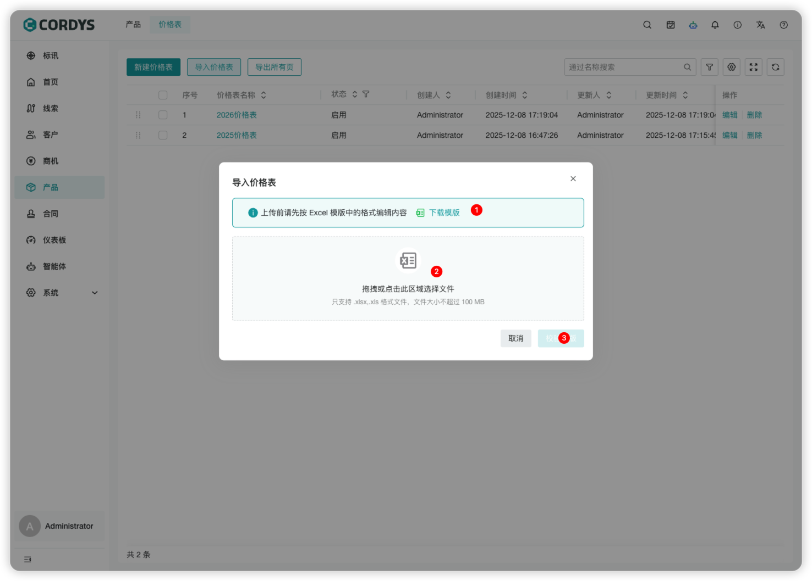
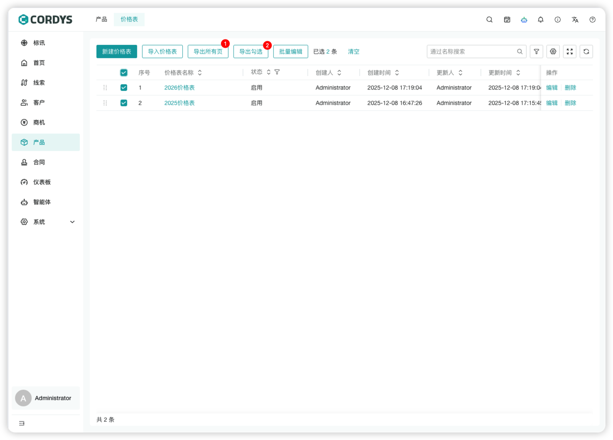
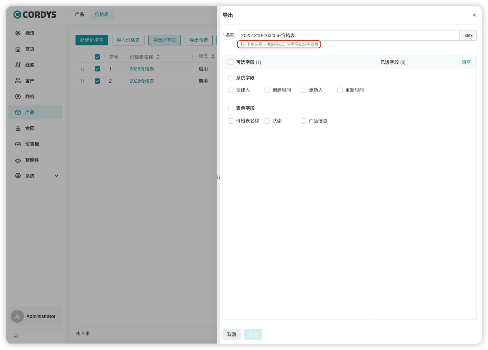

!!! Abstract ""

    在左侧菜单点击【产品】，进入产品管理页面。

## 产品

### 新建产品

!!! Abstract ""  

    用户可以将产品的基础属性（如名称、价格、图片等）录入并保存即可创建成功。
    
     **提示**：产品表单可以根据公司产品特性在表单设置中进行自定义。

### 导入产品

!!! Abstract ""

    点击下载模板，将产品信息维护到模板中，再拖拽到文件区域，点击校验模板即可完成导入产品。

### 管理产品

!!! Abstract ""

    产品列表支持以下功能：
    
    - 调整产品排序
    - 批量产品操作

### 产品详情

!!! Abstract ""

    点击产品名称可查看产品详情。

## 价格表

### 价格表表单设置

!!! Abstract ""

    在左侧菜单点击【系统-模块配置】，点击价格表表单设置。

!!! Abstract ""

    **价格表表单设置**：
    
    - 从左侧选择字段组件，拖拽至中间表单区域
    - 配置属性：在右侧字段属性面板修改字段的基本信息、约束、权限等
    - 调整布局：在表单属性中修改整体表单布局
    
    **产品表格**字段：
    - 支持从左侧选择字段拖拽到表格区域
    - 支持设置表格汇总
    - 支持固定表格列

!!! Abstract ""

    **产品表格-数据源字段**：
    
    - 产品表格内置产品数据源字段
    - **数据过滤**：设置数据过滤规则，跟进规则展示产品列表
    - **显示字段**：设置选择产品时，同步显示关联的字段，依次展示在表格列中
    

### 新建价格表

!!! Abstract ""
    

    “新建价格表” 功能用于创建产品定价清单，支持录入产品信息、定价、税点等内容，是销售报价、产品定价管理的基础工具。
    
    ### 操作步骤
    
    - 步骤 1：进入 “新建价格表” 页面
    
    - 步骤 2：填写基本信息
      价格表名称（必填）：输入价格表的标识名称（如 “2025 年 Q4 产品价目表”）
      状态（必填）：选择 “启用”（创建后即可使用）或 “禁用”（暂不生效），默认选择 “启用”
    - 步骤 3：添加产品信息
      选择产品（必填）：点击 “请选择” 下拉框，选择需要加入价格表的产品
      产品 SKU：手动输入产品对应的 SKU 编码
      产品定价（必填）：输入该产品的定价金额
      税点：输入该产品对应的税率（如 “13” 代表 13%）
      重要说明：填写产品定价的补充说明（如 “含税价”“起订量要求”）
      添加多行产品：点击 “+ 添加一行”，可继续添加其他产品的定价信息
    - 步骤 4：填写备注（可选）
      在 “备注” 文本框中，输入价格表的额外说明（如 “此价格表适用于华东区域渠道客户”）
    - 步骤 5：保存价格表
      确认信息填写完整后，点击弹窗底部 “保存” 按钮，完成价格表创建；若需放弃操作，点击 “取消” 即可
    

### 导入价格表

!!! Abstract ""

    点击下载模板，将产品信息维护到模板中，再拖拽到文件区域，点击校验模板即可完成导入价格表。
    
    **注意** 因价格表存在包含多个产品的场景， 请严格按照模板完成价格表信息维护。

### 导出价格表

!!! Abstract ""

    价格表支持导出所有页或导出勾选的数据
    
    - 导出支持勾选导出字段
    - 导出完成后在**【左下角头像-我的导出】**中查看导出任务进度或**下载**文件。

### 管理价格表

!!! Abstract ""

    价格表列表支持以下功能：
    
    - 调整价格表排序
    - 批量修改价格表操作

