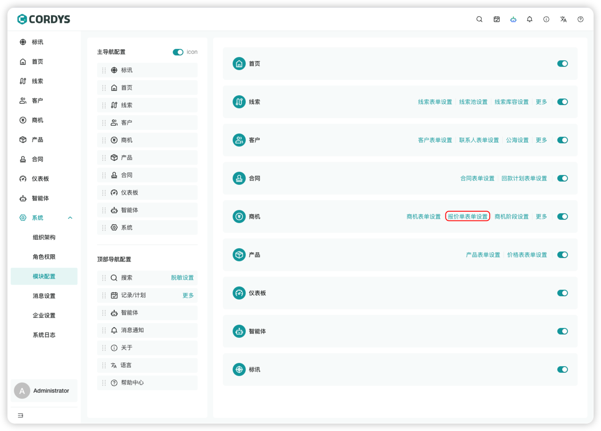
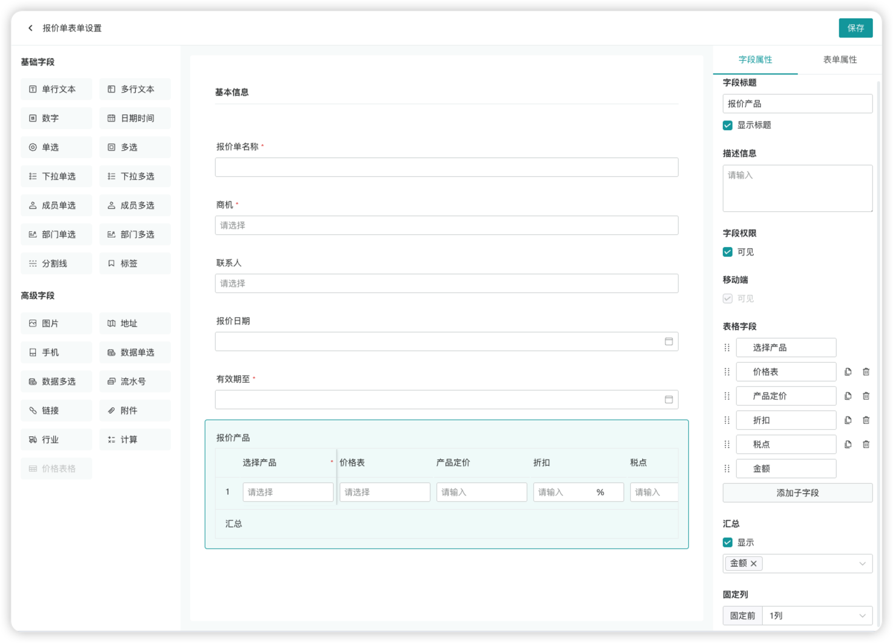
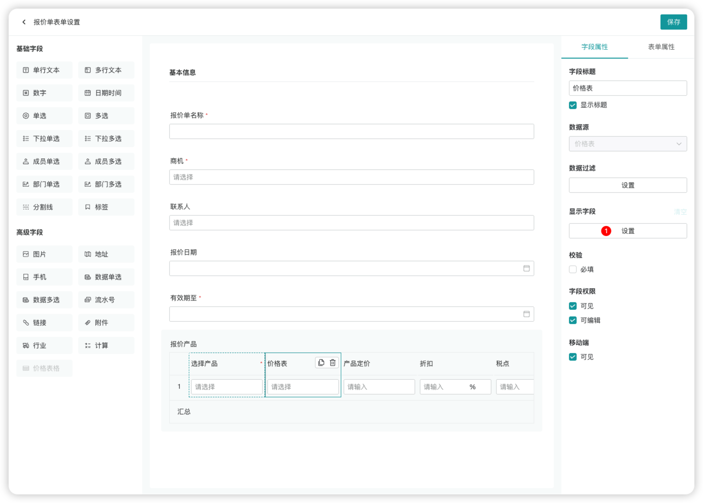
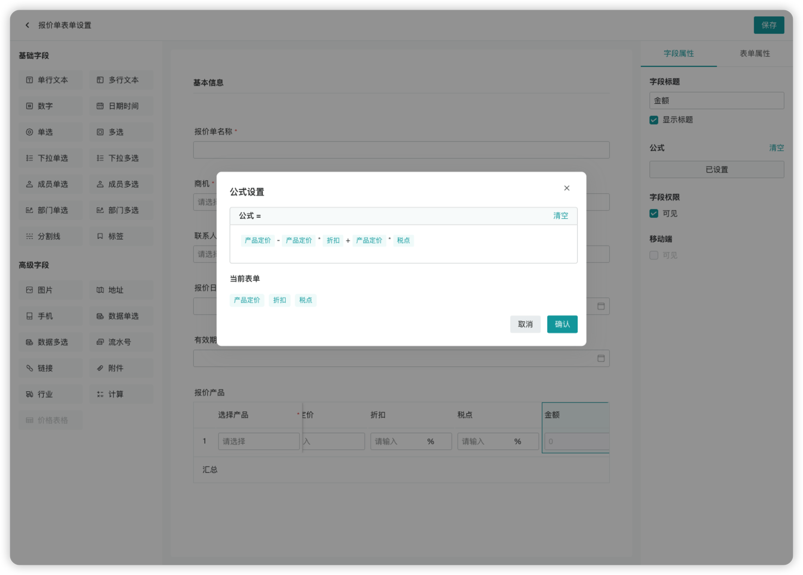
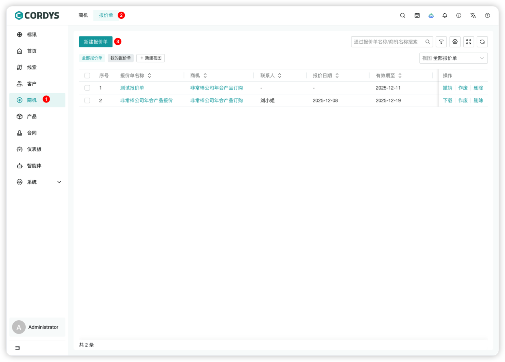
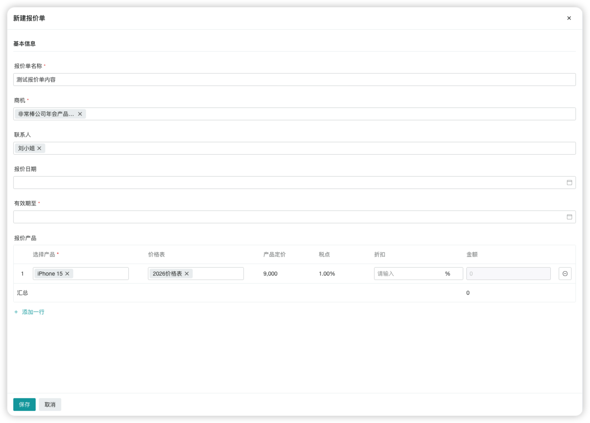
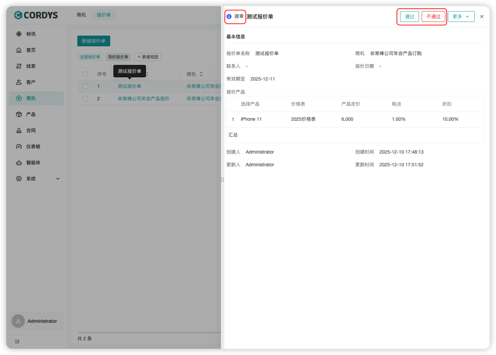
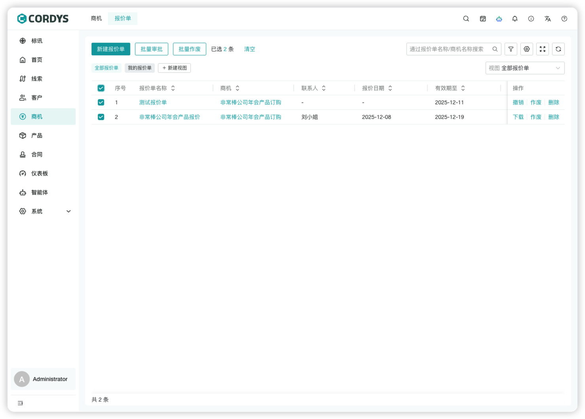

## 线索

### 新建线索

!!! Abstract ""

    在左侧菜单点击【线索】，进入线索管理页面。

!!! Abstract ""

    用户可以「新建线索」或快捷「导入线索」。

!!! Abstract ""

    **提示**：线索表单可以根据公司业务特性在表单设置中进行自定义。

### 线索转换
!!! Abstract ""

    选择线索，点击「转换」，可以快捷将线索转换成客户/商机。

### 线索转为客户

!!! Abstract ""

    在线索详情中，点击「转换」，即可将线索一键转为客户。
    
    **注意**：转客户的线索不会展示在线索列表中。

!!! Abstract ""

    线索转客户需管理员在“客户表单设置”中配置好表单联动，即可将线索信息快捷填充到客户表单。

!!! Abstract ""

    管理员进入【系统-模块设置】，点击「客户表单设置」，进入「表单属性」，设置表单联动。

!!! Abstract ""

    配置好线索表单字段与客户表单字段的映射关系，在进行「线索转客户」操作时即可一键填充相应信息。

## 

## 客户

### 新建客户

!!! Abstract ""

    在左侧菜单点击【客户】，进入客户管理页面，用户可以：
     
     - 「新建客户」
     - 快捷「线索转为客户」

!!! Abstract ""

    **提示**：客户表单可以根据公司业务特性在表单设置中进行自定义。

### 合并客户

!!! Abstract ""

    在左侧菜单点击【客户】，进入客户管理页面。

!!! Abstract ""

    用户需要先「选中客户」然后在隐藏的按钮中选择「合并客户」。

!!! Abstract ""

    :warning: **注意:** 需要确认,「合并后，数据不可回退」。

!!! Abstract ""

    用户需要选择，合并至「已选客户」或者「其他客户」然后选择合并后的客户负责人。

## 商机

### 新建商机

!!! Abstract ""

    在左侧菜单点击【商机】，进入商机管理页面，用户可以：
    
     - 「新建商机」
     - 快捷「线索转为商机」

### 跟进商机
!!! Abstract ""

    点击商机名称或「跟进」按钮，进入商机详情页面。

!!! Abstract ""

    用户可以根据跟进情况进行以下操作：
    
    - 修改商机阶段
    - 录入当前商机的「跟进记录」
    - 添加「跟进计划」

### 商机看板

!!! Abstract ""

    点击看板icon进入「商机看板」视图。
    
    - 商机看板根据商机阶段展示当前商机信息
    - 商机视图均支持列表和看板两种模式查看
    - 修改商机阶段或商机赢率可进入[模块配置-商机阶段设置]调整

### 商机图表

!!! Abstract ""

    点击视图右侧的数据分析icon，进入商机数据分析。

!!! Abstract ""

    进入当前视图的数据分析页。
    
    - 用户可以进一步添加条件进行过滤，也可以基于当前视图直接配置图表类型和分组依据进行「生成图表」
    - 数据指标支持计数、求和、平均三种汇总方式
    - 生成的图表支持全屏展示和下载保存

## 报价单

### 报价单表单设置

!!! Abstract ""

    在左侧菜单点击【系统-模块配置】，点击报价单表单设置。

!!! Abstract ""

    **报价单表单设置**：
    
    - 从左侧选择字段组件，拖拽至中间表单区域
    - 配置属性：在右侧字段属性面板修改字段的基本信息、约束、权限等
    - 调整布局：在表单属性中修改整体表单布局
    
    **报价表格**字段：
    - 支持从左侧选择字段拖拽到表格区域
    - 支持设置表格汇总
    - 支持固定表格列

!!! Abstract ""

    **报价表格-数据源字段**：
    
    - 报价表格内置产品数据源字段和价格表数据源字段
    - **数据过滤**：设置数据过滤规则，跟进规则展示产品列表
    - **显示字段**：设置选择产品时，同步显示关联的字段，依次展示在表格列中
    
    **报价表格-产品定价的三种配置方式**：
    - 在报价表中添加”产品定价“自定义字段，手动录入产品价格
    - 在产品模块中维护产品价格，通过产品数据源的显示字段属性，勾选产品定价带入到当前表格展示
    - 在价格表中维护产品价格，通过价格表数据源的显示自动属性，勾选产品定价带入到当前表格展示，根据选择的产品动态获取价格
    
    **报价表格-计算（金额）字段**：
    - 选择当前表格可参与计算的字段（数字类型）
    - 通过运算符组成完成公式

### 新建报价单

!!! Abstract ""
    

    “新建报价单” 用于快速生成客户所需的产品报价明细，支持关联商机、选择产品并根据价格表自动计算金额，是销售对接客户的核心工具。
    
    ### 操作步骤
    
    - 步骤 1：进入 “新建报价单” 页面
    
    - 步骤 2：填写基本信息
      报价单名称：输入报价单的标识名称（如 “非常棒公司年会产品报价”）
      商机：从下拉框选择对应的商机（关联该报价对应的业务机会）
      联系人：选择该报价对应的客户联系人
      报价日期（可选）：点击日历选择报价的创建日期
      有效期至：点击日历选择报价的失效日期（超过该日期报价自动失效）
     
    - 步骤 3：添加报价产品
      选择产品：点击 “选择产品” 下拉框，选择需报价的产品（如示例中的 “iPhone 15”）
      价格表：手动选择该产品对应的价格表
      产品定价：自动填充价格表中的产品单价（如示例中的 “9,000”）
      税点：自动填充价格表中的税率（如示例中的 “1.00%”）
      折扣：输入对该产品的折扣比例（如 “10” 代表 10% 折扣）
      金额：系统自动计算（公式：产品定价 × (1 - 折扣) × (1 + 税点)）
      添加多行产品：点击 “+ 添加一行”，可继续添加其他报价产品
      
    - 步骤 4：确认并保存
      

### 审批报价单

!!! Abstract ""

    **报价单审批**：系统内置简易审批流，拥有报价单审批权限的用户可以审批报价单。
    
    - 报价单状态：撤销、提示、通过、未通过、作废
    - 报价单创建成功后为**提审**状态，报价单信息为创建时的快照信息，提审状态下不允许修改报价单
    - 用户可以**撤销**提审状态的报价单进行重新编辑，编辑报价单时动态获取最新报价单信息
    - 拥有审批权限的用户可以**通过/不通过**报价单，系统会推送审批结果给报价单创建人
    - 审批**通过**的报价单支持**下载**PDF

### 管理报价单

!!! Abstract ""

    报价单列表支持以下功能：
    
    - 创建报价单视图
    - 拥有审批权限的用户支持批量审批报价单
    - 拥有作废权限的用户支持批量作废报价单

## 活动记录

!!! Abstract ""

    在右上方菜单按钮中点击「活动记录功能」按钮。

!!! Abstract ""

    可以按客户维度查看，创建完成的「跟进记录」或「跟进计划」。

!!! Abstract ""

    点击「详情」按钮，可以查看「跟进记录」或「跟进计划」的详细信息。

