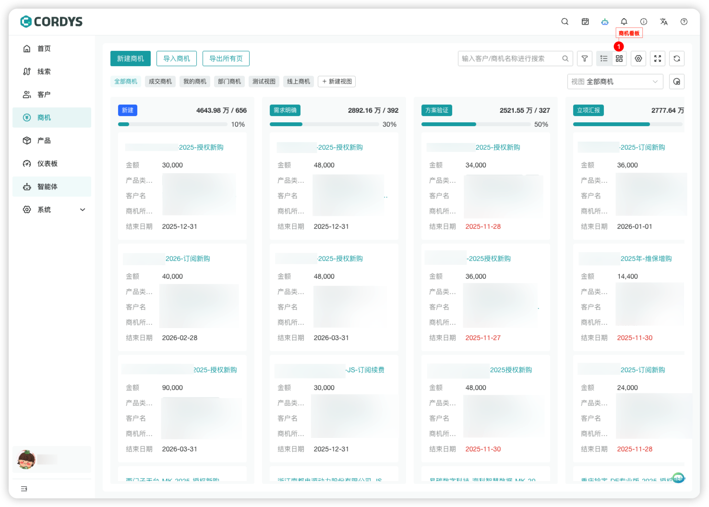
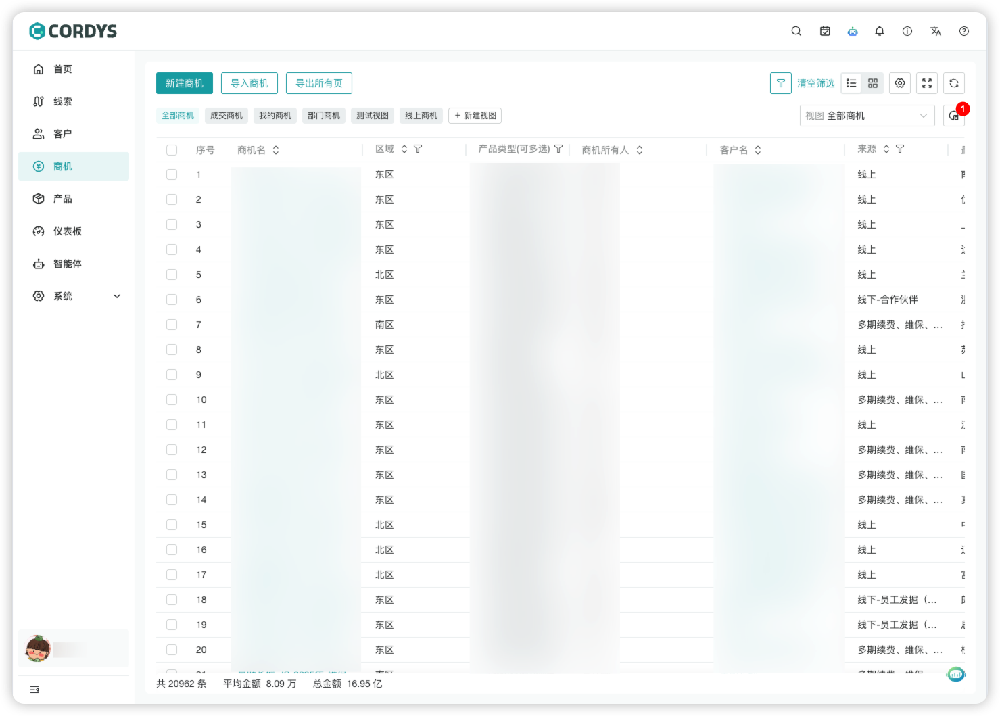
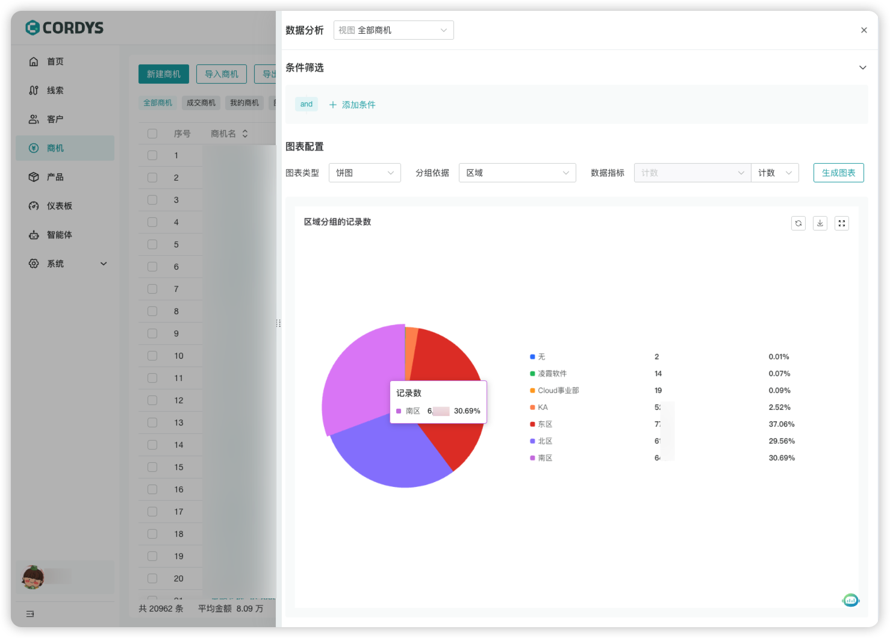

# 日常销售管理

## 新建线索
!!! Abstract ""

    在左侧菜单点击【线索】，进入线索管理页面。

!!! Abstract ""

    用户可以「新建线索」或快捷「导入线索」。

!!! Abstract ""

    **提示**：线索表单可以根据公司业务特性在表单设置中进行自定义。

## 线索转换
!!! Abstract ""

    选择线索，点击「转换」，可以快捷将线索转换成客户/商机。

## 新建客户
!!! Abstract ""

    在左侧菜单点击【客户】，进入客户管理页面，用户可以：
     
     - 「新建客户」
     - 快捷「线索转为客户」

!!! Abstract ""

    **提示**：客户表单可以根据公司业务特性在表单设置中进行自定义。

### 线索转为客户
!!! Abstract ""

    在线索详情中，点击「转换」，即可将线索一键转为客户。
    
    **注意**：转客户的线索不会展示在线索列表中。

!!! Abstract ""

    线索转客户需管理员在“客户表单设置”中配置好表单联动，即可将线索信息快捷填充到客户表单。

!!! Abstract ""

    管理员进入【系统-模块设置】，点击「客户表单设置」，进入「表单属性」，设置表单联动。

!!! Abstract ""

    配置好线索表单字段与客户表单字段的映射关系，在进行「线索转客户」操作时即可一键填充相应信息。

## 新建商机
!!! Abstract ""

    在左侧菜单点击【商机】，进入商机管理页面，用户可以：
    
     - 「新建商机」
     - 快捷「线索转为商机」

## 跟进商机
!!! Abstract ""

    点击商机名称或「跟进」按钮，进入商机详情页面。

### 功能说明

!!! Abstract ""

    用户可以根据跟进情况进行以下操作：
    
    - 修改商机阶段
    - 录入当前商机的「跟进记录」
    - 添加「跟进计划」

## 商机看板

!!! Abstract ""

    点击看板icon进入「商机看板」视图。
    
    - 商机看板根据商机阶段展示当前商机信息
    - 商机视图均支持列表和看板两种模式查看
    - 修改商机阶段或商机赢率可进入[模块配置-商机阶段设置]调整

## 商机图表

!!! Abstract ""

    点击视图右侧的数据分析icon，进入商机数据分析。

!!! Abstract ""

    进入当前视图的数据分析页。
    
    - 用户可以进一步添加条件进行过滤，也可以基于当前视图直接配置图表类型和分组依据进行「生成图表」
    - 数据指标支持计数、求和、平均三种汇总方式
    - 生成的图表支持全屏展示和下载保存

## 合并客户
!!! Abstract ""

    在左侧菜单点击【客户】，进入客户管理页面。

!!! Abstract ""

    用户需要先「选中客户」然后在隐藏的按钮中选择「合并客户」。

!!! Abstract ""

    :warning: **注意:** 需要确认,「合并后，数据不可回退」。

!!! Abstract ""

    用户需要选择，合并至「已选客户」或者「其他客户」然后选择合并后的客户负责人。

## 活动记录
!!! Abstract ""

    在右上方菜单按钮中点击「活动记录功能」按钮。

!!! Abstract ""

    可以按客户维度查看，创建完成的「跟进记录」或「跟进计划」。

!!! Abstract ""

    点击「详情」按钮，可以查看「跟进记录」或「跟进计划」的详细信息。

